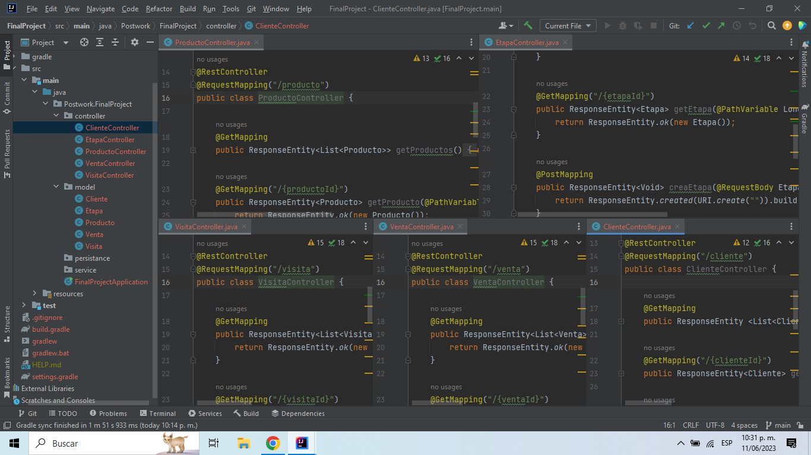

# Postwork #2

En este Postwork se creó la estructura de directorios que tendrá el proyeto final, así como las clases para los 
modelos y sus respectivos controladores junto con sus métodos CRUD generales.

Paquetes con las clases:

-[Model](../src/main/java/Postwork/FinalProject/model)

-[Controller](../src/main/java/Postwork/FinalProject/controllers)

[**`Volver al Inicio`**](../../../)

