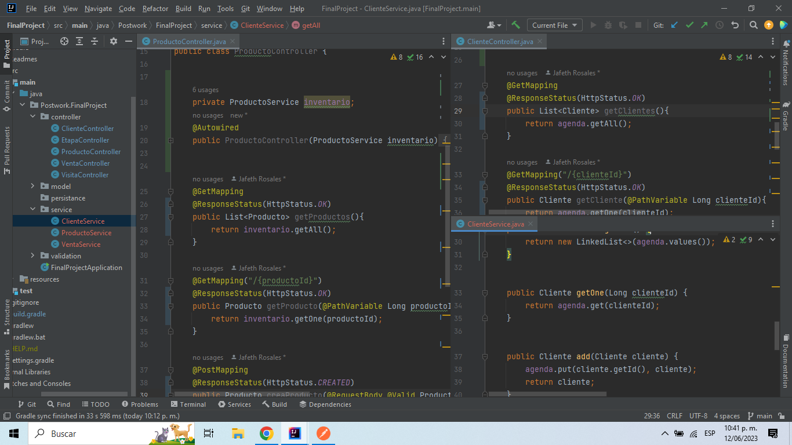
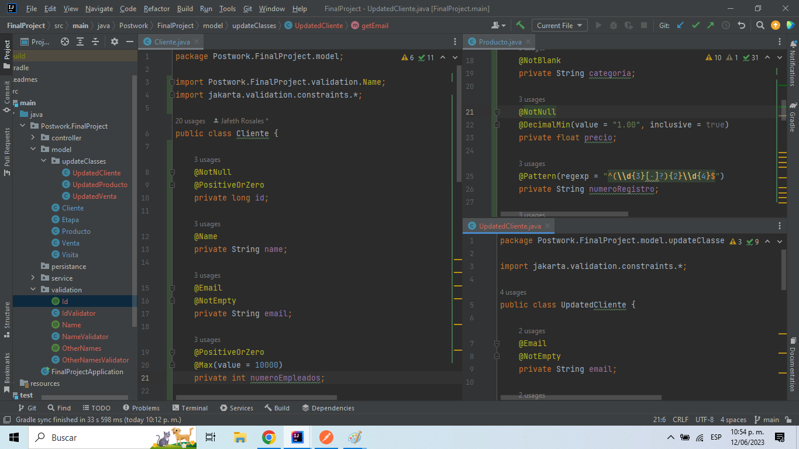
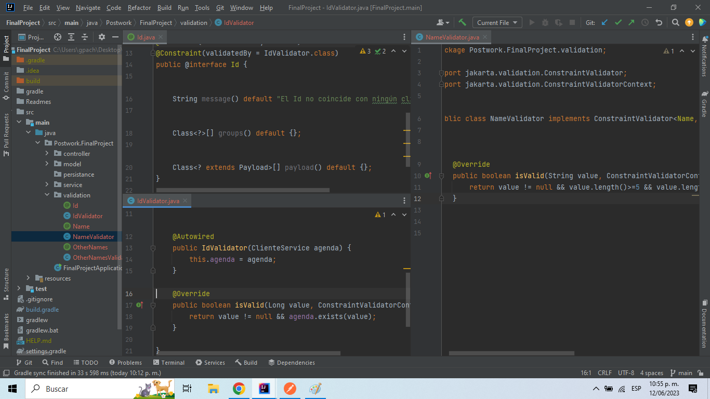

# Postwork #3

En este Postwork se cambió la implementación de los controladores, de modo que el código
se centrara únicamente en ejecutar el método que le corresponde a cada bloque, en lugar de contener
toda la lógica del método. Para ello se creó un nuevo paquete <b>service</b>, que contiene todas las
clases donde se ejecutará la lógica de negocio.
 

 

Por otro lado, también hemos añadido un paquete adicional en model para mejorar la organización
de las clases específicas para los métodos <b>PUT</b>, que actualizan los atributos de otros objetos.
 

 
Y finalmente, hemos generado un paquete para manejar las excepciones que puedan surgir
pues en cada clase de model se incluyeron validaciones a través de la herramienta 
de validación por anotaciones. Si algún método es solicitado y no se cumplen las 
especificaiones de cada uno de sus parámetros, la validación impedirá su registro
lo que garantiza que la información recabada sea más realista.

 

Paquetes con las clases:

-[Model](../src/main/java/Postwork/FinalProject/model)

-[Controller](../src/main/java/Postwork/FinalProject/controller)

-[Service](../src/main/java/Postwork/FinalProject/service)

-[Validation](../src/main/java/Postwork/FinalProject/validation)

[**`Volver al Inicio`**](../../../)
