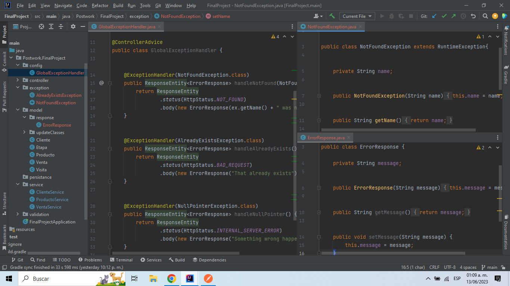
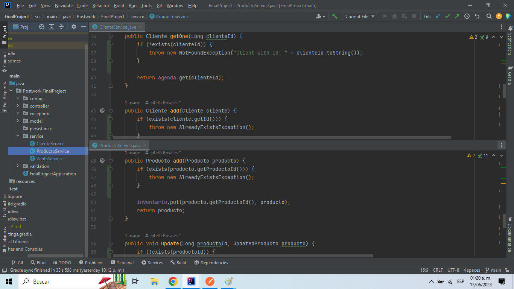
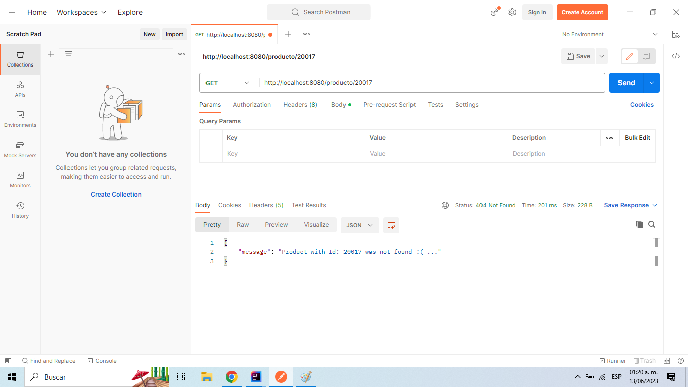
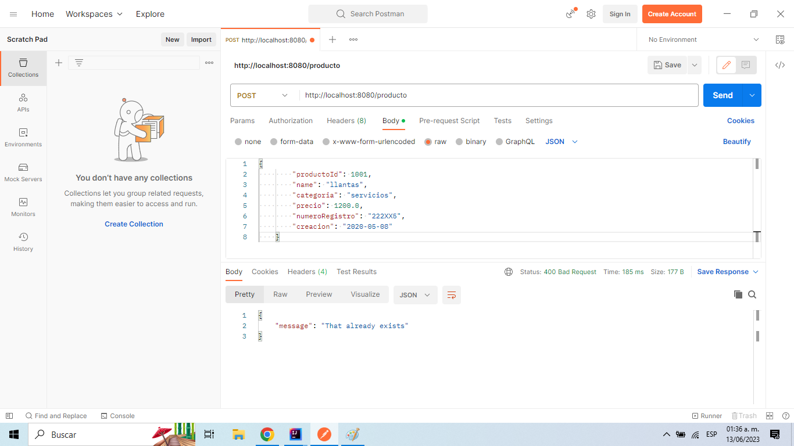

# Postwork #4

En este Postwork agregamos un manejador de errores a nuestro proyecto.
Un manejador de errores ayudará a los usuarios de nuestra API a entender 
mejor la naturaleza de un error, ya sea que esté enviando un parámetro 
incorrecto, o que algo haya salido mal del lado del servidor.
Para ello, hemos creado 3 nuevos paquetes. En el paquete <b>config</b> se encuentra
la clase *GlobalExceptionHandler*, donde se usan las anotaciones
<b>@ControllerAdvice</b> y <b>@ExceptionHandler</b>, que indican la respuesta HTTP
obtenida cuando se lleve a cabo determinada excepcion; además de encargarse
de devolvernos un mensaje de vuelta con contenido más detallado del error.
En el paquete **exception** se crean las clases que extenderán  de Runtime Exception, 
de modo que al detectarse ese tipo de excepción se ejecuten y finalmente el modelo 
ErrorResponse contendrá la estructura del mensaje de respuesta de la excepción.
 

 
Por otro lado, también hemos se realizaron cambios en las clases **service** para que
se implementaran las pruebas de validación y se ejecutaran las excepciones respectivamente.
 

 
Al ejecutar nuestra app y mandar una petición errónea podemos visualizar
un mensaje más detallado del motivo de dicho error.

 

 

Paquetes con las clases:

-[Model -> Response](../src/main/java/Postwork/FinalProject/model/response)

-[Exception](../src/main/java/Postwork/FinalProject/exception)

-[Service](../src/main/java/Postwork/FinalProject/services)

-[Config](../src/main/java/Postwork/FinalProject/config)

[**`Volver al Inicio`**](../../../)
