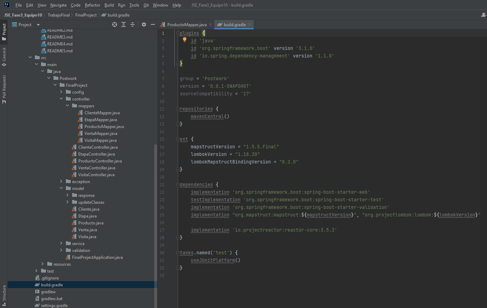
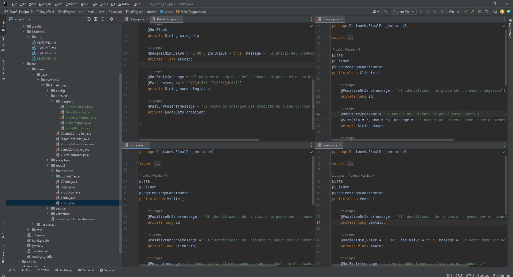
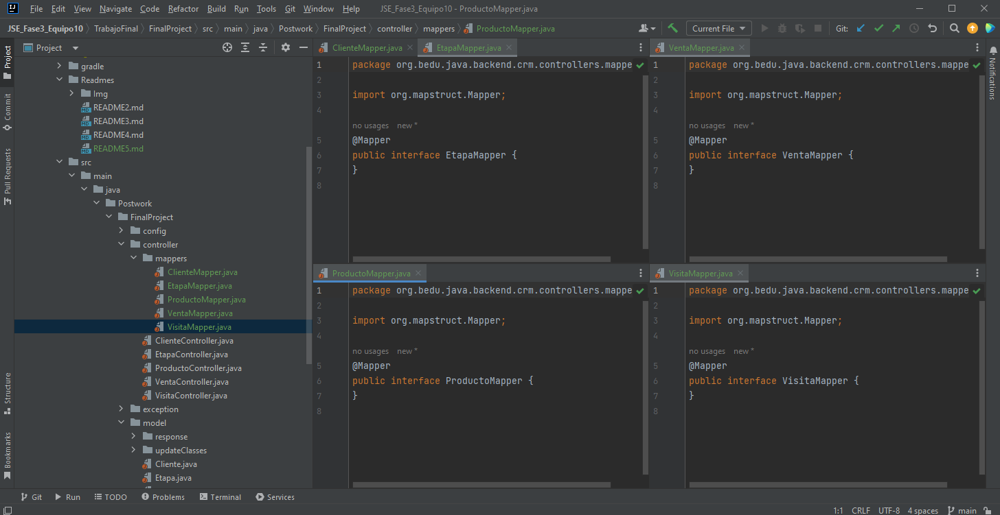

# Postwork #5

En este Postwork agregamos las dependencias de Lombok y MapStruct en el archivo build.gradle del proyecto.
 
 

 

Despues a los objetos del paquete model les agregamos las anotaciones de Lombok: @Data, @Builder y @RequiredArgsConstructor.
 
 

 
Por ultimo, dentro del paquete controllers agregamos un subpaquete mappers y agregamos una interface de mapper para cada uno de los tipos de objetos en el paquete model (excluyendo RespuestaError). 
Tambien agregamos a cada interfaz con @Mapper.
 
 

 
 

Paquetes con las clases:

-[Model -> Response](../src/main/java/Postwork/FinalProject/model/response)

-[Exception](../src/main/java/Postwork/FinalProject/exception)

-[Service](../src/main/java/Postwork/FinalProject/services)

-[Config](../src/main/java/Postwork/FinalProject/config)

[**`Volver al Inicio`**](../../../)
