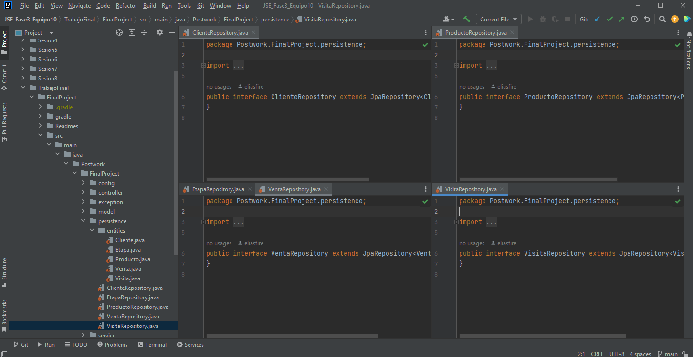
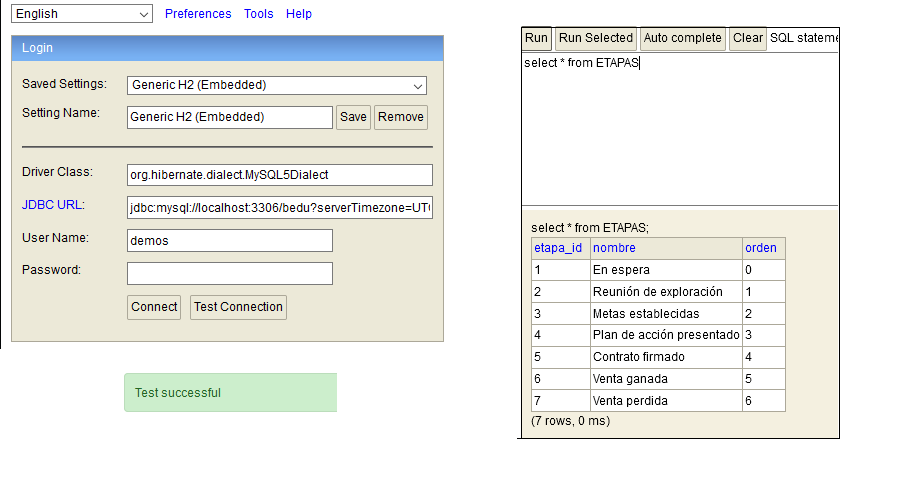

# Postwork #6

En este Postwork agregamos el driver de MySQL como dependencia del proyecto. Luego creamos un nuevo paquete llamado entities, dentro del paquete persistence, el cual contiene una copia de las entidades contenidas en el paquete model, y luego le pusimos las anotaciones de JPA en lugar de las validaciones. Y despues creamos un repositorio para cada una de las entidades (interface que extiende de JpaRepository).
 
 

 

Por ultimo, agregamos la dependencia de H2 a la aplicación, probamos la conexion e hicimos una prueba de consulta.

 
 

 

Paquetes con las clases:

-[Model -> Response](../src/main/java/Postwork/FinalProject/model/response)

-[Exception](../src/main/java/Postwork/FinalProject/exception)

-[Service](../src/main/java/Postwork/FinalProject/service)

-[Config](../src/main/java/Postwork/FinalProject/config)

[**`Volver al Inicio`**](../../../)
