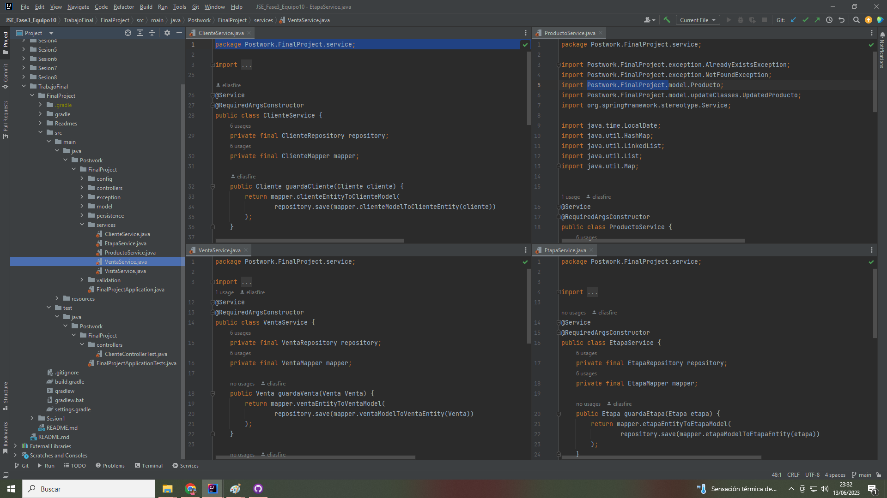
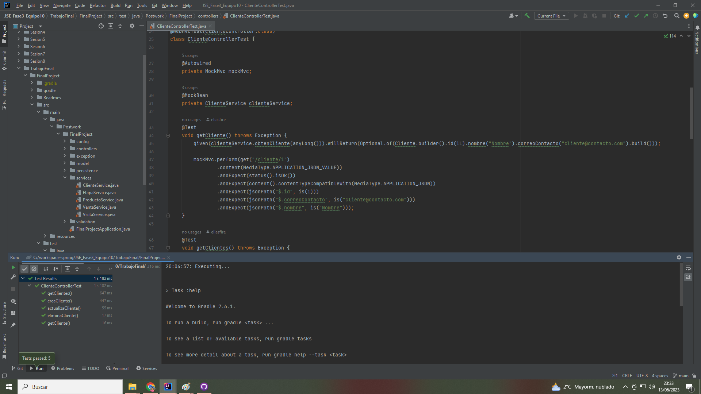

# Postwork #7

En este Postwork terminamos la implementación de los métodos de negocio (capa services), esto nos permite tener las funcionalidades básicas CRUD para cada entidad (guardar, eliminar, baja y actualizacion).
 
 

 

Por ultimo, agregamos pruebas unitarias de cada uno de los métodos existentes en los controladores usando el objeto MockMvc de Spring.
 
 

 

Paquetes con las clases:

-[Model -> Response](../src/main/java/Postwork/FinalProject/model/response)

-[Exception](../src/main/java/Postwork/FinalProject/exception)

-[Service](../src/main/java/Postwork/FinalProject/services)

-[Config](../src/main/java/Postwork/FinalProject/config)

[**`Volver al Inicio`**](../../../)
