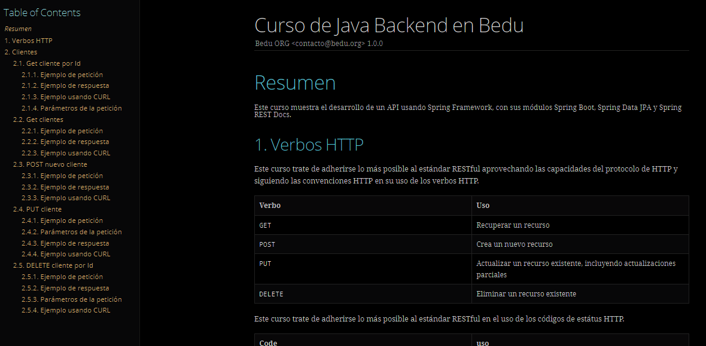

# Postwork #8

En este Postwork para cada una de las pruebas, unitarias o de integración, de los servicios REST creados, generamos su documentación. Decoramos la clase de prueba con la anotación @AutoConfigureRestDocs, para que para cada uno de los métodos HTTP usados en las pruebas (GET, POST, PUT y DELETE) se genere la documentación con el método andDo de la instancia MockMvc.
 
 

 

Dentro del directorio principal creamos un subdirectorio docs y dentro otro subdirectorio asciidocs. Dentro de este crea un archivo llamado index.adoc que luego personalizamos el contenido del archivo.
 
 

 

Por ultimo, ejecutamos la aplicación y entramos en http://localhost:8080/docs/index.html y vemos que la documentación se genero de forma correcta:
 
 

 

Paquetes con las clases:

-[Model -> Response](../src/main/java/Postwork/FinalProject/model/response)

-[Exception](../src/main/java/Postwork/FinalProject/exception)

-[Service](../src/main/java/Postwork/FinalProject/services)

-[Config](../src/main/java/Postwork/FinalProject/config)

[**`Volver al Inicio`**](../../../)
